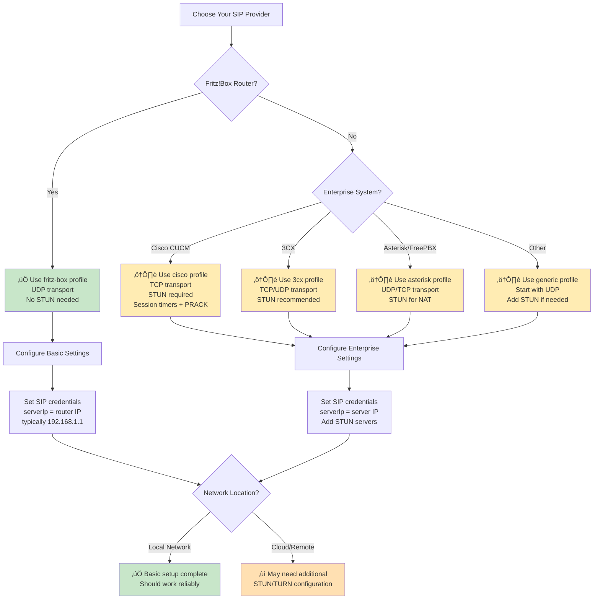

# CallCenter.js MCP + CLI

**An MCP Server, CLI tool, and API that makes phone calls on your behalf using VoIP.**

Just tell Claude what you want to accomplish, and it will call and handle the conversation for you. This is essentially an MCP Server that bridges between OpenAI's Real-Time Voice API and your VoIP connection to call people on your behalf.

> **⚠️ Vibe-coded side project!** Please do not use this in any kind of professional context. This is a side project coded in a weekend. There are no guard rails. Your MCP client can call *any* number with this, even if you don't ask it to. In fact, it has done so during testing - it called a random number during the night "for testing" and played back scary low-pitched noises - then claimed it called MY number. So YMMV, no warranties. See [disclaimer](#️-important-disclaimer) below.

## üìû Example: Order Pizza with Claude

**You:** "Can you call Tony's Pizza and order a large pepperoni pizza for delivery to 123 Main St? My name is John and my number is 555-0123."

**Claude automatically calls the restaurant:**

```
‚è∫ mcp__callcenter_js__simple_call(phone_number: "+15551234567", 
                                    brief: "Call Tony's Pizza and order a large pepperoni pizza for delivery to 123 Main St. Customer name is John, phone number 555-0123", 
                                    caller_name: "John")
  ‚éø # Simple Call Result
    
    **Status:** ‚úÖ Success  
    **Duration:** 3 minutes 24 seconds
    **Call ID:** abc123xyz
    
    ## Call Transcript
    
    [14:23:15] 🎤 HUMAN: Tony's Pizza, how can I help you?
    [14:23:15] 🤖 ASSISTANT: Hi! I'm calling on behalf of John to place a delivery order.
    [14:23:20] 🎤 HUMAN: Sure! What would you like?
    [14:23:20] 🤖 ASSISTANT: I'd like to order one large pepperoni pizza for delivery please.
    [14:23:25] 🎤 HUMAN: Large pepperoni, got it. What's the delivery address?
    [14:23:25] 🤖 ASSISTANT: The address is 123 Main Street.
    [14:23:30] 🎤 HUMAN: And your phone number?
    [14:23:30] 🤖 ASSISTANT: The phone number is 555-0123.
    [14:23:35] 🎤 HUMAN: Perfect! That'll be $18.99. We'll have it delivered in about 30 minutes.
    [14:23:40] 🤖 ASSISTANT: That sounds great! Thank you so much.
    [14:23:42] 🎤 HUMAN: You're welcome! Have a great day.
```

**Pizza ordered successfully!** üçï

## üìö Quick Context for the Uninitiated

**VoIP (Voice over IP)** is how you make phone calls over the internet instead of traditional phone lines. **SIP (Session Initiation Protocol)** is the language these systems speak to connect calls. Think of it as HTTP but for phone calls.

**Fritz!Box** is a popular German router/modem that happens to have a built-in phone system (PBX). If you have one, you already have everything you need to make VoIP calls - this tool just connects to it. Outside Germany, you might know similar devices from other brands, or use dedicated VoIP services like Asterisk, 3CX, or cloud providers.

**MCP (Model Context Protocol)** is Anthropic's standard for connecting AI assistants like Claude to external tools and services. It's what lets MCP clients actually *do* things instead of just talking about them.

## üöÄ What This Enables

- üîå **MCP Server** - Use directly in Claude Code or any MCP client (most popular usage)
- 🖥️ **CLI Tool** - Command-line interface for direct phone calls  
- üìö **TypeScript API** - Programmatic library for building voice applications

Built as a bridge between OpenAI's Real-Time Voice API and VoIP networks, with multiple codec support (G.722, G.711), and expanded SIP protocol support for broad VoIP compatibility. Compatible with the latest `gpt-realtime` model released August 28, 2025.

## 🏗️ System Architecture


> **⚠️ Vibe-coded project!** Developed and tested on Fritz!Box (a German router with built-in VoIP) only. Other provider configs are research-based but untested. YMMV, no warranties. See [disclaimer](#️-important-disclaimer) below.


## üîå MCP Client Integration (Most Popular!)

**Perfect for when your coding agent needs to call library authors to complain about their documentation!** üòÑ

### Quick Setup

```bash
# Add to Claude Code with one command:
claude mcp add --env SIP_USERNAME=your_actual_extension \
  --env SIP_PASSWORD="your_actual_password" \
  --env SIP_SERVER_IP=192.168.1.1 \
  --env OPENAI_API_KEY="sk-your_actual_openai_key" \
  --env USER_NAME="Your Actual Name" \
  -- callcenter.js npx -- github:gerkensm/callcenter.js-mcp --mcp
```

**Then just ask your MCP Client to make calls:**

> "Can you call the pizza place and order a large pepperoni? My number is 555-0123."

Your MCP Client will automatically handle the entire conversation using the AI Voice Agent! 🤖📞

## ‚ú® Key Features

- 🎙️ **Multiple Codec Support**: G.722 wideband (16kHz) + G.711 fallback for broad compatibility
- 🤖 **AI-Powered Conversations**: Uses OpenAI's Real-Time Voice API with the latest `gpt-realtime` model (released August 28, 2025) for actual calls, with o3-mini model for instruction generation
- üåç **Automatic Language Detection**: Intelligently detects conversation language from call briefs and configures transcription accordingly
- üé≠ **Auto Voice Selection**: New 'auto' mode where o3-mini selects optimal voice based on call context (formality, industry, goals)
- üîä **Voice Characteristics**: Full support for all 10 OpenAI Realtime API voices with gender and personality awareness
- üåê **Expanded SIP Support**: Configurations for common SIP providers (Fritz!Box tested, others experimental)
- üîß **Smart Configuration**: Auto-detects provider requirements and optimizes settings
- üìû **Enterprise-Ready**: Supports advanced SIP features (STUN/TURN, session timers, transport fallback)
- 🔄 **Robust Connection Management**: Automatic reconnection with intelligent error handling
- ‚úÖ **Built-in Validation**: Comprehensive configuration validation with network testing
- 🎯 **Provider Profiles**: Pre-configured settings for popular SIP systems
- üîå **MCP Server**: Integrate with MCP clients like Claude Code
- üìö **TypeScript API**: Programmatic library for building voice applications
- üìù **Call Brief Processing**: Natural language call instructions using o3-mini model with structured JSON output
- üéµ **Optional Call Recording**: Stereo WAV recording with caller/AI separation

## üöÄ Quick Start

### Option 1: Run Instantly with npx (No Installation) ‚ö°

**Fastest way to try it out:**

```bash
# Set environment variables (or create .env file)
export SIP_USERNAME="your_extension"
export SIP_PASSWORD="your_password"
export SIP_SERVER_IP="192.168.1.1"
export OPENAI_API_KEY="sk-your-key-here"

# Run directly from GitHub (no installation needed!)
npx github:gerkensm/callcenter.js-mcp call "+1234567890" --brief "Call restaurant for reservation" --user-name "Your Name"
```

**Or using a .env file:**

```bash
# Create .env file
cat > .env << EOF
SIP_USERNAME=your_extension
SIP_PASSWORD=your_password
SIP_SERVER_IP=192.168.1.1
OPENAI_API_KEY=sk-your-key-here
SIP_PROVIDER=fritz-box
OPENAI_VOICE=auto
EOF

# Run from GitHub (loads .env automatically)  
npx github:gerkensm/callcenter.js-mcp call "+1234567890" --brief "Call restaurant"
```

**Note**: First run may show build warnings if you don't have C++ build tools, but will work fine with G.711 codec fallback (standard phone quality). For **much better audio quality**, install build tools first to enable G.722 wideband codec.

### Option 2: Local Installation

#### Prerequisites

- Node.js 20+
- **Python 3.x + Build tools** (for G.722 wideband audio - **much better call quality**)
  - macOS: Xcode Command Line Tools (`xcode-select --install`)
  - Windows: Visual Studio Build Tools 
  - Linux: `build-essential` package
- OpenAI API key

**Note**: Without build tools, the system automatically falls back to G.711 (standard phone quality). G.722 provides 2x bandwidth for clearer, more natural conversations.

#### Installation

```bash
# Clone and install
git clone https://github.com/gerkensm/callcenter.js-mcp
cd callcenter.js-mcp
npm install

# Copy example configuration
cp config.example.json config.json
```

### Configuration

Edit `config.json` with your settings:

```json
{
  "sip": {
    "username": "your_sip_username",
    "password": "your_sip_password", 
    "serverIp": "192.168.1.1",
    "serverPort": 5060,
    "provider": "fritz-box"
  },
  "ai": {
    "openaiApiKey": "sk-your-openai-api-key-here",
    "voice": "alloy",
    "instructions": "You are a helpful AI assistant making phone calls on behalf of users.",
    "userName": "Your Name"
  }
}
```

## 🎯 Usage Options

### 1. MCP Server (Claude Code Integration) ⭐

**Most popular usage** - integrates with Claude Code for seamless AI-powered calling. Perfect for when your coding agent needs to call library authors to complain about their documentation! üòÑ

#### **Quick Setup with npx (Recommended)** 

**Option 1: Using MCP Client CLI (Easiest)**

```bash
# Replace with your ACTUAL credentials before running:
claude mcp add --env SIP_USERNAME=your_actual_extension \
  --env SIP_PASSWORD="your_actual_password" \
  --env SIP_SERVER_IP=192.168.1.1 \
  --env OPENAI_API_KEY="sk-your_actual_openai_key" \
  --env USER_NAME="Your Actual Name" \
  -- callcenter.js npx -- github:gerkensm/callcenter.js-mcp --mcp
```

**⚠️ Important:** Replace the placeholder values with your actual SIP credentials and OpenAI API key, or the server will fail to connect.

**Option 2: Manual Configuration**

Configure in Claude Code's MCP settings to automatically pull from GitHub:

```json
{
  "mcpServers": {
    "callcenter.js": {
      "command": "npx",
      "args": ["github:gerkensm/callcenter.js-mcp", "--mcp"],
      "env": {
        "SIP_USERNAME": "your_extension",
        "SIP_PASSWORD": "your_password",
        "SIP_SERVER_IP": "192.168.1.1",
        "OPENAI_API_KEY": "sk-your-key-here",
        "USER_NAME": "Your Name"
      }
    }
  }
}
```

#### **Alternative: Local Installation**

For local development or if you prefer local installation:

```bash
npm start --mcp
```

Or configure Claude Code with local installation:

```json
{
  "mcpServers": {
    "callcenter.js": {
      "command": "node",
      "args": ["dist/cli.js", "--mcp"],
      "cwd": "/path/to/voip-agent"
    }
  }
}
```

Available MCP tools:
- `simple_call` - Make calls with automatic instruction generation
- `advanced_call` - Make calls with granular parameter control

**Example usage in MCP Client:**

```
You: "Can you call Bocca di Bacco restaurant and book a table for 2 people tonight at 7:30pm? My name is John Doe."

MCP Client: I'll call Bocca di Bacco restaurant to book a table for 2 people tonight at 7:30pm.

üîß mcp__ai-voice-agent__simple_call(
  phone_number: "+1234567890",
  brief: "Call Bocca di Bacco restaurant and book a table for 2 people tonight at 7:30pm",
  caller_name: "John Doe"
)

‚úÖ Call completed successfully! 
üìû Duration: 2 minutes 15 seconds
üìù Reservation confirmed for 2 people at 7:30pm tonight
```

**More examples:**

```
You: "My internet is down. Can you call my ISP and get a status update? I'm Sarah Johnson, account #12345."

MCP Client: I'll call your internet service provider to check on the outage status.

üîß mcp__ai-voice-agent__simple_call(
  phone_number: "+18005551234", 
  brief: "Call ISP about internet outage, customer Sarah Johnson account #12345",
  caller_name: "Sarah Johnson"
)
```

```
You: "Call Dr. Smith's office to reschedule my 3pm appointment to next week. I'm Mike Chen."

MCP Client: I'll call Dr. Smith's office to reschedule your appointment.

üîß mcp__ai-voice-agent__simple_call(
  phone_number: "+15551234567",
  brief: "Call Dr. Smith's office to reschedule Mike Chen's 3pm appointment to next week", 
  caller_name: "Mike Chen"
)
```

The MCP Client automatically handles the entire conversation using the AI Voice Agent!

### 2. Command Line Interface

**Perfect for when you need to `curl -X POST` your way out of social obligations, or finally implement that O(n log n) `ai-human-sort` algorithm - because nothing says "efficient sorting" like crowdsourcing comparisons to random strangers via VoIP!** üòÑ

**üí° Use `--brief` instead of `--instructions` for better results!**

The `--brief` option uses OpenAI's o3-mini model to generate sophisticated instructions from your simple description, while `--instructions` sends your text directly to the Real-Time Voice API. Since the Real-Time Voice API is optimized for speed (not sophistication), `--brief` typically produces much better call outcomes.

```bash
# ‚úÖ RECOMMENDED: Use brief for natural language goals
npm start call "+1234567890" --brief "Call the restaurant and book a table for 2 at 7pm tonight" --user-name "John Doe"

# ‚úÖ RECOMMENDED: Brief works for any call type
npm start call "+1234567890" --brief "Call to check appointment availability for John Doe"

# ⚠️ ONLY use instructions for very specific, custom behavior
npm start call "+1234567890" --instructions "You must follow this exact script: Say hello, ask for manager, then hang up"

# Other examples with brief
npm start call "+1234567890" --record "meeting.wav" --duration 300 --brief "Conference call to discuss project status"
npm start call "+1234567890" --log-level verbose --brief "Test call to verify connectivity"
```

#### CLI Options

```bash
npm start call <number> [options]

Options:
  -c, --config <path>           Configuration file path (default: config.json)
  -d, --duration <seconds>      Maximum call duration in seconds (default: 600)
  -v, --verbose                 Verbose mode - show all debug information
  -q, --quiet                   Quiet mode - show only transcripts, errors, and warnings
  --log-level <level>           Set log level (quiet|error|warn|info|debug|verbose) (default: info)
  --no-colors                   Disable colored output
  --no-timestamp                Disable timestamps in logs
  --record [filename]           Enable stereo call recording (optional filename)
  --brief <text>                Call brief to generate instructions from (RECOMMENDED)
  --instructions <text>         Direct AI instructions (use only for specific custom behavior)
  --user-name <name>            Your name for the AI to use when calling
  --voice <name>                Voice to use (default: auto) - see Voice Selection section
  --help                        Display help information
```

### 3. Programmatic API

```typescript
import { makeCall, createAgent } from 'callcenter.js';

// Simple call with brief
const result = await makeCall({
  number: '+1234567890',
  brief: 'Call Bocca di Bacco and book a table for 2 at 19:30 for Torben',
  userName: 'Torben',
  config: 'config.json'
});

console.log(`Call duration: ${result.duration}s`);
console.log(`Transcript: ${result.transcript}`);

// Advanced usage with agent instance
const agent = await createAgent('config.json');

agent.on('callEnded', () => {
  console.log('Call finished!');
});

await agent.makeCall({ 
  targetNumber: '+1234567890',
  duration: 300 
});
```

## üìö API Reference

### `makeCall(options: CallOptions): Promise<CallResult>`

Make a phone call with the AI agent.

#### CallOptions

```typescript
interface CallOptions {
  number: string;                    // Phone number to call
  duration?: number;                 // Call duration in seconds
  config?: string | Config;          // Configuration file path or object
  instructions?: string;             // Direct AI instructions (highest priority)
  brief?: string;                    // Call brief to generate instructions from
  userName?: string;                 // Your name for the AI to use
  recording?: boolean | string;      // Enable recording with optional filename
  logLevel?: 'quiet' | 'error' | 'warn' | 'info' | 'debug' | 'verbose';
  colors?: boolean;                  // Enable colored output
  timestamps?: boolean;              // Enable timestamps in logs
}
```

#### CallResult

```typescript
interface CallResult {
  callId?: string;                   // Call ID if successful
  duration: number;                  // Call duration in seconds
  transcript?: string;               // Full conversation transcript
  success: boolean;                  // Whether call was successful
  error?: string;                    // Error message if failed
}
```

### `createAgent(config, options?): Promise<VoiceAgent>`

Create a VoiceAgent instance for advanced use cases.

```typescript
const agent = await createAgent('config.json', {
  enableCallRecording: true,
  recordingFilename: 'call.wav'
});

// Event handlers
agent.on('callInitiated', ({ callId, target }) => {
  console.log(`Call ${callId} started to ${target}`);
});

agent.on('callEnded', () => {
  console.log('Call ended');
});

agent.on('error', (error) => {
  console.error('Call error:', error.message);
});
```

### Configuration Structure

```typescript
interface Config {
  sip: {
    username: string;
    password: string;
    serverIp: string;
    serverPort?: number;
    provider?: string;
    stunServers?: string[];
    turnServers?: TurnServer[];
  };
  ai: {
    openaiApiKey: string;
    voice?: 'auto' | 'alloy' | 'ash' | 'ballad' | 'cedar' | 'coral' | 'echo' | 'marin' | 'sage' | 'shimmer' | 'verse';
    instructions?: string;
    brief?: string;
    userName?: string;
  };
  logging?: {
    level?: string;
  };
}
```

### Environment Variables

All configuration options can be set via environment variables (useful for npx usage):

#### **Required Variables:**
```bash
SIP_USERNAME=your_extension
SIP_PASSWORD=your_password  
SIP_SERVER_IP=192.168.1.1
OPENAI_API_KEY=sk-your-key-here
USER_NAME="Your Name"                                     # Required when using --brief
```

#### **Optional Variables:**
```bash
# SIP Configuration
SIP_SERVER_PORT=5060
SIP_LOCAL_PORT=5060
SIP_PROVIDER=fritz-box                                    # fritz-box, asterisk, cisco, 3cx, generic
STUN_SERVERS="stun:stun.l.google.com:19302,stun:stun2.l.google.com:19302"
SIP_TRANSPORTS="udp,tcp"

# OpenAI Configuration  
OPENAI_VOICE=auto                                        # auto (recommended), marin, cedar, alloy, echo, shimmer, coral, sage, ash, ballad, verse
OPENAI_INSTRUCTIONS="Your custom AI instructions"

# Advanced SIP Features
SESSION_TIMERS_ENABLED=true
SESSION_EXPIRES=1800
SESSION_MIN_SE=90
SESSION_REFRESHER=uac
```

**Priority order:** CLI flags > Config file > Environment variables

## ‚úÖ Quick Success Check

Before making real calls, validate your setup with these safe tests:

### 1. Configuration Validation
```bash
# Basic validation - checks syntax and required fields
npm run validate config.json

# Detailed validation with network connectivity tests  
npm run validate:detailed

# Get specific fix suggestions for issues
npm run validate:fix
```

### 2. Test Call to Yourself (Fritz!Box users)
```bash
# Call your own extension to verify audio quality (safe test)
npm start call "**620" --brief "Test call to check audio quality" --user-name "Your Name" --duration 30

# Or use your mobile number for end-to-end test
npm start call "+49123456789" --brief "Quick test call" --user-name "Your Name" --duration 15
```

### 3. What to Expect
- ‚úÖ **Working setup**: Clear audio, proper AI responses, clean call termination
- ⚠️ **Network issues**: "Connection failed" errors → check firewall/STUN settings  
- ⚠️ **Auth problems**: "401 Unauthorized" → verify SIP credentials
- ⚠️ **Codec issues**: Poor audio quality → G.722 compilation may have failed

> **Pro tip**: Start with `--duration 30` for test calls to avoid long waits if something goes wrong.

## üìã Configuration Validation

The built-in validation system provides comprehensive analysis:

```bash
# Basic validation
npm run validate config.json

# Detailed validation with network connectivity tests
npm run validate:detailed

# Get specific fix suggestions for issues
npm run validate:fix

# Test example configurations for different providers
npm run validate:fritz-box       # AVM Fritz!Box
npm run validate:asterisk        # Asterisk PBX  
npm run validate:cisco           # Cisco CUCM
npm run validate:3cx             # 3CX Phone System
npm run validate:generic         # Generic SIP provider
```

The validator will check:
- ‚úÖ **Configuration syntax and required fields**
- ‚úÖ **Provider-specific requirements**
- ‚úÖ **Network connectivity to SIP server**
- ‚úÖ **STUN server reachability**
- ‚úÖ **Codec availability (G.722/G.711)**
- ‚úÖ **Provider compatibility score**

## üåê SIP Provider Compatibility

### ‚úÖ **Actually Tested** 

- **AVM Fritz!Box** - German router brand with built-in VoIP/SIP phone system ‚úÖ **WORKS** (only one actually tested)

### 🤷 **Vibe-coded Configs** (Educated Guesses)

- **Asterisk PBX** - Open source PBX (FreePBX, Elastix, etc.) 🤷 **UNTESTED**
- **Cisco CUCM** - Enterprise Unified Communications 🤷 **UNTESTED** 
- **3CX Phone System** - Popular business PBX 🤷 **UNTESTED**
- **Generic SIP Providers** - Standards-compliant SIP trunks 🤷 **UNTESTED**

### üîß **Provider-Specific Features**

The provider profiles are based on research and documentation, not actual testing:

| Provider | Transport | NAT Traversal | Session Timers | PRACK | Keepalive |
|----------|-----------|---------------|----------------|--------|----------|
| **Fritz Box** | UDP | Not needed | Optional | Disabled | Re-register |
| **Asterisk** | UDP/TCP | STUN | Supported | Optional | OPTIONS ping |
| **Cisco CUCM** | TCP preferred | STUN required | Required | Required | OPTIONS ping |
| **3CX** | TCP/UDP | STUN | Supported | Optional | Re-register |

### Configuration Decision Tree



### üìù **Configuration Examples**

The project includes ready-to-use configurations for all major providers:

- `config.example.json` - **AVM Fritz!Box** (home/SMB default)
- `config.asterisk.example.json` - **Asterisk PBX** with advanced features
- `config.cisco.example.json` - **Cisco CUCM** enterprise setup
- `config.3cx.example.json` - **3CX Phone System** configuration
- `config.generic.example.json` - **Generic SIP provider** template

## üéµ Audio Quality & Codecs

### Codec Priority & Negotiation

1. **G.722** (Preferred) - 16kHz wideband, superior voice quality
2. **G.711 μ-law** (Fallback) - 8kHz narrowband, universal compatibility  
3. **G.711 A-law** (Fallback) - 8kHz narrowband, European standard

### G.722 Implementation

- **Native C++ addon** for optimal performance
- **Based on reference implementations** from CMU and Sippy Software
- **Automatic fallback** to G.711 if compilation fails
- **Real-time encoding/decoding** with low latency

### Optional Call Recording

- **Stereo WAV format** with caller on left channel, AI on right channel
- **Optional filename** specification
- **Synchronized audio streams** for perfect alignment
- **High-quality PCM recording** at native sample rates

### Testing Audio Quality

```bash
# Test codec availability
npm run test:codecs

# Build without G.722 if needed
npm run build:no-g722
```

## 🤖 AI Call Brief Processing

### Why This Matters: Real-Time Voice API Needs Better Instructions

OpenAI's Real-Time Voice API is **optimized for speed, not sophistication**. It's great at natural conversation but struggles with complex, goal-oriented tasks without very specific instructions. Here's the problem:

**‚ùå What doesn't work well:**
```bash
# Vague brief - Real-Time Voice API will be confused and unfocused
npm start call "+1234567890" --brief "Call the restaurant and book a table"
```

**‚ùå What's tedious and error-prone:**
```bash
# Writing detailed instructions manually every time
npm start call "+1234567890" --instructions "You are calling on behalf of John Doe to make a restaurant reservation for 2 people at Bocca di Bacco for tonight at 7pm. You should start by greeting them professionally, then clearly state your purpose. Ask about availability for 7pm, and if not available, ask for alternative times between 6-8pm. Confirm the booking details including date, time, party size, and get a confirmation number if possible. If you reach voicemail, leave a professional message with callback information..."
```

**‚úÖ What works brilliantly:**
```bash
# Simple brief - o3 model generates sophisticated instructions
npm start call "+1234567890" --brief "Call Bocca di Bacco and book a table for 2 at 7pm tonight" --user-name "John Doe"
```

### How It Works

The system uses OpenAI's **o3-mini reasoning model** (their latest small reasoning model - smart but fast) to automatically generate detailed, sophisticated instructions from your simple brief. The o3-mini model:

1. **Analyzes your brief** and understands the goal
2. **Creates conversation states** and flow logic  
3. **Generates specific instructions** for each phase of the call
4. **Handles edge cases** like voicemail, objections, and alternatives
5. **Adapts language and tone** based on context
6. **Provides fallback strategies** when things don't go as planned

### Call Flow Sequence


### Before/After Example

**Your simple input:**
```
"Call Bocca di Bacco and book a table for 2 at 7pm tonight"
```

**What o3-mini generates (excerpt):**
```
## Personality and Tone
Identity: I am an assistant calling on behalf of John Doe to make a restaurant reservation.
Task: I am responsible for booking a table for 2 people at Bocca di Bacco today at 7:00 PM.
Tone: Professional, warm, and respectful.

## Instructions
1. Open the conversation immediately: "Hello, this is an assistant calling on behalf of John Doe."
2. Read back critical data: Repeat times and details for confirmation.
3. Handle objections: Respond politely and offer alternatives between 6-8 PM.
...

## Conversation States
[
  {
    "id": "1_greeting",
    "description": "Greeting and introduction of call purpose",
    "instructions": ["Introduce yourself as an assistant", "Immediately mention the reservation request"],
    "examples": ["Hello, this is an assistant calling on behalf of John Doe. I'm calling to book a table for 2 people today at 7:00 PM."]
  }
]
```

### Automatic Adaptations

The o3-mini brief processor automatically:
- **Detects language** from your brief and generates instructions in that language
- **Creates conversation flow** with logical states and transitions
- **Handles cultural context** (German restaurants vs. American vs. Japanese)
- **Generates appropriate examples** with real phrases (no placeholders)
- **Provides voicemail scripts** for when nobody answers
- **Plans for objections** and alternative solutions

### When to Use Each Approach

- **Use `--brief`** for 95% of calls - it's easier and produces better results
- **Use `--instructions`** only when you need very specific, custom behavior
- **Brief processing** is perfect for: reservations, appointments, business calls, customer service
- **Direct instructions** are better for: highly specialized scenarios, testing, or when you've already perfected your prompt

## 🎤 Voice Selection

The AI agent supports 10 different voices from OpenAI's Realtime API, each with unique characteristics. By default, the system uses **auto mode** where o3-mini intelligently selects the optimal voice based on your call's context.

### Available Voices

| Voice | Gender | Description | Best For |
|-------|--------|-------------|----------|
| **marin** | Female | Clear, professional feminine voice | All-purpose: business calls, customer support, negotiations |
| **cedar** | Male | Natural masculine voice with warm undertones | All-purpose: professional calls, consultations, service interactions |
| **alloy** | Neutral | Professional voice with good adaptability | Technical discussions, business contexts, general inquiries |
| **echo** | Male | Conversational masculine voice | Casual to formal interactions, versatile tone |
| **shimmer** | Female | Warm, expressive feminine voice | Empathetic conversations, sales, professional contexts |
| **coral** | Female | Warm and friendly feminine voice | Customer interactions, consultations, support calls |
| **sage** | Neutral | Calm and thoughtful voice | Medical consultations, advisory roles, serious discussions |
| **ash** | Neutral | Clear and precise voice | Technical explanations, instructions, educational content |
| **ballad** | Female | Melodic and smooth feminine voice | Presentations, storytelling, engaging conversations |
| **verse** | Neutral | Versatile and expressive voice | Dynamic conversations, adaptable to any context |

### Auto Voice Selection (Recommended)

The **auto mode** (default) uses o3-mini to analyze your call context and select the most appropriate voice:

```bash
# Auto mode - AI selects the best voice
npm start call "+1234567890" --brief "Call doctor's office to schedule appointment" --user-name "John"
# Might select: sage (calm, professional for healthcare)

# Auto mode adapts to context
npm start call "+1234567890" --brief "Call pizza place to order delivery" --user-name "Sarah"  
# Might select: coral or echo (friendly, casual for food service)
```

### Manual Voice Selection

You can override auto selection when you have specific requirements:

```bash
# Use a specific voice
npm start call "+1234567890" --voice marin --brief "Call to book reservation" --user-name "Alex"

# Professional contexts
npm start call "+1234567890" --voice cedar --brief "Call bank about account" --user-name "Pat"

# Friendly service calls
npm start call "+1234567890" --voice coral --brief "Call flower shop for delivery" --user-name "Sam"
```

### Configuration Options

Set default voice in your config file or environment:

```json
// config.json
{
  "ai": {
    "voice": "auto",  // or specific voice like "marin", "cedar", etc.
    // ...
  }
}
```

```bash
# Environment variable
export OPENAI_VOICE=auto  # or marin, cedar, alloy, etc.
```

### Voice Selection Guidelines

The auto mode considers these factors:

- **Formality Level**: High (cedar, marin, sage) ‚Üí Medium (alloy, verse) ‚Üí Low (echo, coral, shimmer)
- **Industry Context**: Healthcare (sage, shimmer), Finance (cedar, sage), Retail (coral, echo), Tech (alloy, ash)
- **Goal Type**: Authority needed (cedar, sage), Friendliness (coral, shimmer), Efficiency (marin, alloy)
- **Language**: Voices adapt to detected language from your call brief

### MCP Integration

The MCP tools strongly recommend auto mode but support manual override:

```typescript
// Simple call - auto voice selection
mcp__callcenter_js__simple_call({
  phone_number: "+1234567890",
  brief: "Call restaurant for reservation",
  caller_name: "John",
  voice: "auto"  // Optional, defaults to auto
})

// Advanced call - manual voice selection
mcp__callcenter_js__advanced_call({
  phone_number: "+1234567890",
  goal: "Schedule medical appointment",
  user_name: "Jane",
  voice: "sage"  // Override for specific voice
})
```

## 🔄 Advanced Features

### Smart Connection Management

- **Automatic Reconnection**: Exponential backoff with provider-specific error handling
- **Transport Fallback**: UDP ‚Üí TCP ‚Üí TLS based on what works
- **Provider-Aware Error Recovery**: Different strategies for Fritz Box vs. Asterisk vs. Cisco
- **Network Change Handling**: Adapts to network connectivity changes

### Enhanced SIP Protocol Support

- **STUN/TURN Integration**: NAT traversal for cloud and enterprise deployments
- **Session Timers (RFC 4028)**: Connection stability for long calls
- **PRACK Support (RFC 3262)**: Reliable provisional responses for enterprise systems
- **Multiple Transports**: UDP, TCP, TLS with intelligent fallback

### Configuration Intelligence

- **Provider Auto-Detection**: Identifies provider from SIP domain/IP
- **Requirements Validation**: Ensures all provider-specific needs are met  
- **Network Testing**: Real connectivity tests to SIP servers and STUN servers
- **Optimization Suggestions**: Actionable recommendations for better performance

## 🛠️ Development & Testing

### Build Commands

```bash
# Full build (TypeScript + native addon)
npm run build

# Build components separately  
npm run build:native    # Native G.722 addon only
npm run build:ts       # TypeScript compilation only

# Development with hot reload
npm run dev

# Clean all build artifacts
npm run clean
```

### Configuration Testing

```bash
# Validate any config file
npm run validate path/to/config.json

# Test with different providers
npm run validate -- --provider asterisk config.json

# Get detailed network diagnostics
npm run validate -- --detailed --network config.json

# Show fix suggestions for issues
npm run validate -- --fix-suggestions config.json
```

### Project Structure

```
src/
├── voice-agent.ts          # Main orchestration with ConnectionManager
├── connection-manager.ts   # Smart connection handling & reconnection
├── sip-client.ts          # Enhanced SIP protocol with provider support
├── audio-bridge.ts        # RTP streaming and codec management
├── openai-client.ts       # OpenAI Real-Time Voice API integration
├── call-brief-processor.ts # o3-mini model call brief processing
├── mcp-server.ts          # MCP (Model Context Protocol) server
├── validation.ts          # Configuration validation engine
├── config.ts             # Enhanced config loading with provider profiles
├── logger.ts             # Comprehensive logging with transcript capture
├── index.ts              # Main programmatic API exports
├── providers/
│   └── profiles.ts       # Provider-specific configuration database
├── testing/
│   └── network-tester.ts # Real network connectivity testing
├── codecs/               # Codec abstraction layer
│   ├── g722.ts          # G.722 wideband implementation
│   └── g711.ts          # G.711 fallback codecs
└── cli.ts               # Command-line interface

scripts/
└── validate-config.js   # Comprehensive validation CLI tool

config.*.example.json    # Provider-specific example configurations
```

## üìä Validation & Diagnostics

The built-in validation system provides comprehensive analysis:

### Configuration Report Example

```
üîç CallCenter.js Configuration Validator

üìã Provider: AVM Fritz!Box (auto-detected)
🎯 Provider Compatibility Score: 100%

‚úÖ Configuration is valid and ready for use!

üåê Network Connectivity:
   ‚úÖ SIP Server: Reachable (12ms latency)
   ‚úÖ G.722 codec: Available for high-quality audio

üí° Optimization Suggestions:
   üí° G.722 wideband codec available (already enabled)
   üí° Excellent latency - local network performance optimal

üöÄ Next steps: npm start call "<number>"
```

### Network Diagnostics

- **Real SIP Server Testing**: Actual UDP/TCP connectivity tests
- **STUN Server Validation**: Tests NAT traversal capability
- **Latency Measurement**: Network performance assessment
- **Provider-Specific Recommendations**: Tailored advice based on detected issues

## üîß Troubleshooting

### Configuration Issues

1. **Run validation first**:
   ```bash
   npm run validate:detailed
   ```

2. **Check provider compatibility**:
   ```bash
   npm run validate -- --provider fritz-box config.json
   ```

3. **Get specific fix suggestions**:
   ```bash
   npm run validate:fix
   ```

### Network Connectivity

- **Fritz Box**: Usually works with UDP on local network
- **Cloud/Enterprise**: May need STUN servers for NAT traversal
- **Firewall Issues**: Ensure SIP port (5060) and RTP ports are open

### Audio Quality

1. **Verify G.722 is available**:
   ```bash
   npm run test:codecs
   ```

2. **Check codec negotiation in logs**:
   ```
   ‚úÖ Selected codec: PT 9 (G722/8000)
   ```

3. **Network issues**: High latency/packet loss affects audio quality

### Build Problems

1. **Native compilation fails**:
   ```bash
   # Install build tools first, then:
   npm run build:no-g722  # Fallback to G.711 only
   ```

2. **Provider-specific issues**: Check validation recommendations for your provider

### MCP Integration Issues

1. **Server won't start**:
   ```bash
   # Check for port conflicts or config issues
   npm start --mcp
   ```

2. **Claude Code not connecting**:
   - Verify MCP server configuration in Claude Code settings
   - Check that the working directory path is correct
   - Ensure the server is running and accessible

## üìà What I Built

This is a personal project that includes:

- **üåê Fritz!Box Support**: Actually tested and works
- **🤷 Other SIP Configs**: Vibe-coded based on documentation reading
- **🔄 Connection Handling**: Seems to work, has retry logic
- **‚úÖ Config Validation**: Catches obvious mistakes
- **üìä Network Testing**: Basic connectivity checks
- **🎯 Provider Profiles**: Research-based guesses about different systems
- **üîå MCP Server**: Works with Claude Code (tested)
- **üìö TypeScript API**: Clean interfaces for programmatic use
- **üìù Call Brief Processing**: Uses o3-mini to generate instructions (works well)
- **üéµ Optional Call Recording**: Stereo WAV files with left/right channels
- **üìã Transcript Capture**: Real-time conversation logs

## ⚠️ Important Disclaimer

**This project is vibe-coded!** üöÄ 

This means:
- ‚úÖ **Works on Fritz!Box** - that's what I actually tested
- 🤷 **Other providers** - I tried to make it more useful but can't promise anything
- 🤷 **Advanced features** - seemed like good ideas based on research, but who knows
- ⚠️ **YMMV** - your setup is probably different than mine
- ⚠️ **No warranties** - use at your own risk

### What This Means for You

- **Fritz Box users**: Should work great! ‚úÖ
- **Other providers**: The configuration profiles are educated guesses based on research - they might work, they might not
- **Enterprise users**: I tried to add the features that seemed important, but I have no idea if they actually work correctly
- **Issues & PRs**: I'll accept pull requests, but I can't promise to fix issues I can't reproduce or test

### If You Want to Contribute

- ‚úÖ **Test it on your setup** and let others know what works
- ‚úÖ **Share working configs** if you get something else working
- ‚úÖ **Fix stuff that's broken** and submit PRs
- ‚úÖ **Tell me if my assumptions were wrong** about how providers work

The validation tools might help debug issues, but honestly, the real test is whether you can make actual calls.

## üìú License

MIT License - see [LICENSE](LICENSE) for details.

### Third-Party Components

- **G.722 Codec**: Public domain and BSD licensed implementations
- **SIP Protocol**: Based on sipjs-udp (MIT licensed)
- **Dependencies**: Various open source licenses (see package.json)

## 🤝 Contributing

1. Fork the repository
2. Create a feature branch  
3. Add/update validation for new providers
4. Test with `npm run validate:detailed`
5. Submit a pull request

## üìû Support

- **Configuration Issues**: Use `npm run validate:detailed` for diagnostics
- **Provider Support**: Check compatibility matrix above
- **Build Problems**: See troubleshooting section
- **Feature Requests**: You can open GitHub issues, but they're unlikely to get attention anytime soon. Pull requests are much preferred!

---

**Ready to get started?** Copy an example config, run `npm run validate:detailed`, and start making AI-powered voice calls! üöÄ
