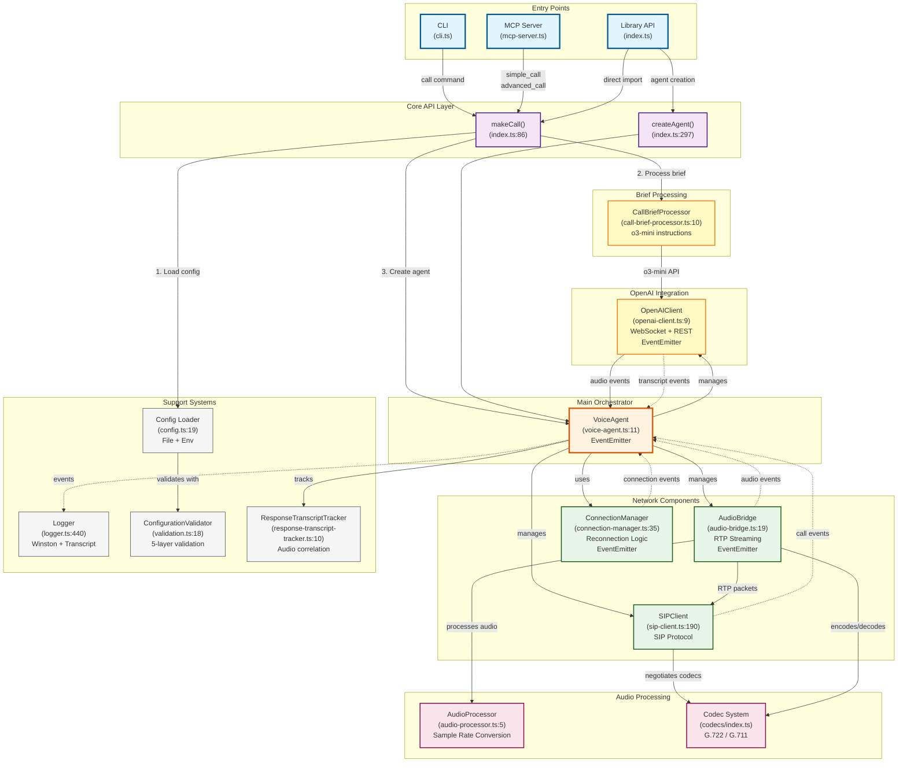
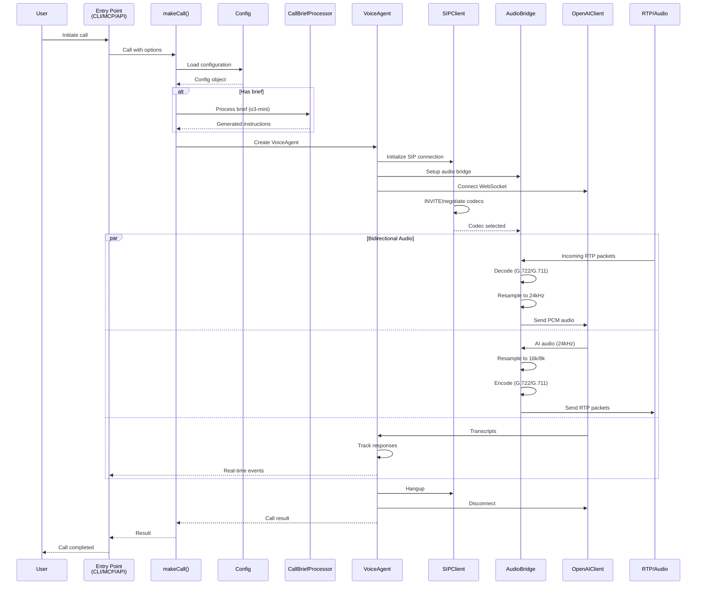

# Architecture Call Graph

## Main Entry Points and Module Interactions

This diagram shows the primary entry points and call flow between major modules in the VoIP Agent system.

## Call Flow Sequence

## Key Design Patterns

### Event-Driven Architecture
- **EventEmitters**: VoiceAgent, AudioBridge, OpenAIClient, ConnectionManager
- **Event Flow**: Components communicate asynchronously via events
- **Decoupling**: Loose coupling between major components

### Module Responsibilities

| Module | Primary Responsibility | Key Methods/Events |
|--------|----------------------|-------------------|
| **VoiceAgent** | Main orchestrator | `startCall()`, `endCall()`, emits: `callStarted`, `callEnded`, `error` |
| **SIPClient** | SIP protocol handling | `call()`, `hangup()`, handles INVITE/BYE |
| **AudioBridge** | RTP streaming & codecs | `startRTPSession()`, `processAudio()` |
| **OpenAIClient** | OpenAI API integration | WebSocket events, REST for brief processing |
| **CallBriefProcessor** | Natural language → instructions | `generateInstructions()` using o3-mini |
| **ConnectionManager** | Reconnection with backoff | `connect()`, `reconnect()`, exponential backoff |

### Data Flow Patterns

1. **Configuration Priority**: CLI flags > Config file > Environment variables
2. **Brief Processing**: Natural language → o3-mini → structured instructions
3. **Audio Pipeline**: RTP → Decode → Resample → OpenAI → Resample → Encode → RTP
4. **Response Tracking**: OpenAI response IDs → transcript correlation → audio completion

### Critical Paths

1. **Call Initiation**:
   - Entry → makeCall → Config → VoiceAgent → SIPClient

2. **Audio Processing**:
   - RTP packets → AudioBridge → Codec → AudioProcessor → OpenAI

3. **Transcript Handling**:
   - OpenAI → ResponseTracker → VoiceAgent → Logger (transcript channel)